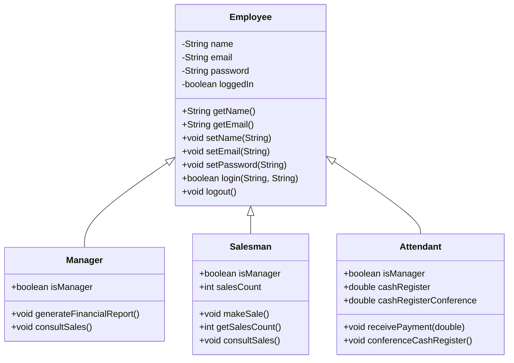

# EmployeeControl

EmployeeControl é um projeto Java simples para gerenciar diferentes tipos de funcionários: Gerentes, Vendedores e Atendentes.

## 🚀 Começando

Estas instruções permitirão que você obtenha uma cópia do projeto em execução em sua máquina local para fins de desenvolvimento e teste.

### Pré-requisitos

*   Java Development Kit (JDK) instalado
*   Um terminal ou prompt de comando

### Compilando

Para compilar os arquivos Java, navegue até o diretório raiz do projeto e execute o seguinte comando:

```bash
javac -d bin src/*.java
```

### Executando

Após a compilação, você pode executar a aplicação principal com este comando:

```bash
java -cp bin Main
```

## Estrutura do Projeto

O projeto está estruturado com as seguintes classes:

*   **`Employee`**: Uma classe base com atributos e métodos comuns a todos os funcionários, como `name`, `email`, `password`, `login()` e `logout()`.
*   **`Manager`**: Uma subclasse de `Employee` com métodos adicionais como `generateFinancialReport()` e `consultSales()`.
*   **`Salesman`**: Uma subclasse de `Employee` que pode `makeSale()` e `consultSales()`.
*   **`Attendant`**: Uma subclasse de `Employee` responsável por `receivePayment()` e `conferenceCashRegister()`.
*   **`Main`**: A classe principal para executar e testar as funcionalidades das outras classes.

## Diagrama de Classes



## 🧑‍💻 Autor

*   **Arthur** - *Trabalho inicial* - [Arthur](https://github.com/arthur)